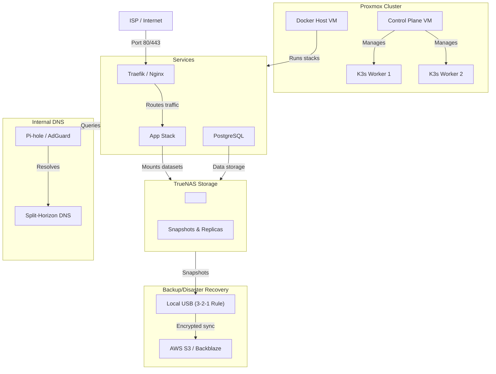

# Homelab Commander: Full-Stack Infrastructure Specialist

This skill consolidates Docker self-hosting, TrueNAS storage ops, Proxmox virtualization, K3s deployment, and disaster recovery into one unified domain specialist for production-grade homelabs.

---

## I. DOCKER SELF-HOSTING PATTERNS

### Why Docker for Homelab?
Containerization provides isolation (prevents app conflicts), reproducibility (same container runs everywhere), and resource efficiency (multiple services on one machine). Docker Compose orchestrates multi-container apps declaratively—one YAML file replaces dozens of manual docker run commands.

### Docker Compose Structure

Always organize Compose files for clarity, security, and maintainability:

```yaml
version: '3.8'

services:
  # Application tier
  app:
    image: myapp:v1.2.3  # Pin tags—:latest breaks silently
    container_name: myapp
    restart: unless-stopped
    environment:
      DB_HOST: db
      DB_USER: ${DB_USER}  # Load from .env or secrets
      DB_PASS: ${DB_PASS}
    volumes:
      - /data/myapp:/app/data  # Bind TrueNAS mounts here
      - /etc/localtime:/etc/localtime:ro
    networks:
      - internal
    depends_on:
      - db
    healthcheck:
      test: ["CMD", "curl", "-f", "http://localhost:8080/health"]
      interval: 30s
      timeout: 5s
      retries: 3

  # Database tier
  db:
    image: postgres:15-alpine
    restart: unless-stopped
    environment:
      POSTGRES_DB: ${DB_NAME}
      POSTGRES_USER: ${DB_USER}
      POSTGRES_PASSWORD: ${DB_PASS}
    volumes:
      - db_data:/var/lib/postgresql/data
    networks:
      - internal

  # Reverse proxy (single entry point for all services)
  reverse_proxy:
    image: traefik:v3.0
    restart: unless-stopped
    ports:
      - "80:80"
      - "443:443"
    environment:
      TRAEFIK_API_INSECURE: "false"
      TRAEFIK_PROVIDERS_DOCKER: "true"
    volumes:
      - /var/run/docker.sock:/var/run/docker.sock:ro
      - /data/traefik:/etc/traefik
    networks:
      - external

volumes:
  db_data:
    driver: local
    driver_opts:
      type: nfs
      o: addr=<NAS_IP>,vers=4,soft,timeo=180,bg,tcp
      device: ":<NAS_PATH>/db_data"

networks:
  internal:
    driver: bridge
  external:
    driver: bridge
```

**Why these patterns?**
- **Pin image tags**: `:latest` auto-updates and breaks reliability. Use semantic versioning (v1.2.3).
- **Environment variables**: Keep secrets out of version control. Load from `.env` (git-ignored) or orchestrator secrets.
- **Healthchecks**: Catch hung services; Docker/Compose restarts unhealthy containers automatically.
- **depends_on**: Ensures startup order (app waits for db). Add healthcheck to make it wait for readiness.
- **Named networks**: Containers communicate by service name (e.g., `db:5432` not IP addresses).
- **NFS volumes**: TrueNAS exports datasets via NFS; mounts survive container restarts.

### TrueNAS Integration: NFS Mounts

Create datasets in TrueNAS for each service:

```bash
# From Proxmox host or Docker node:
mkdir -p /mnt/nas/docker/{myapp,postgres,mediaserver}

# Mount with soft NFS options (survives brief disconnections)
mount -t nfs -o vers=4,soft,timeo=180,bg,tcp <NAS_IP>:/mnt/pool/apps/myapp /mnt/nas/docker/myapp
```

**Why soft mounts + bg?** Hard mounts hang the system if NAS is unreachable; soft with bg allows non-blocking reconnection.

### Reverse Proxy: Single Entry Point

Traefik or nginx-proxy routes external traffic to all internal services:

```yaml
services:
  app:
    labels:
      traefik.enable: "true"
      traefik.http.routers.myapp.rule: "Host(`app.example.com`)"
      traefik.http.routers.myapp.tls.certresolver: "letsencrypt"
      traefik.http.services.myapp.loadbalancer.server.port: "8080"
```

**Why?** One public IP/domain for all services. TLS termination, HTTPS redirect, automatic Let's Encrypt renewal. Simplifies firewall rules (only port 80/443 exposed).

### Secrets Management

Never hardcode secrets. Use one of:

```bash
# 1. .env file (git-ignored, loaded by docker-compose)
DB_PASS=super_secret_123

# 2. Docker secrets (Swarm or Kubernetes)
docker secret create db_pass -
# Inside service: ${DB_PASS} from /run/secrets/db_pass

# 3. Sealed Secrets / External Secret Operator (Kubernetes)
# Encrypt at rest in Git

# 4. HashiCorp Vault / Bitwarden Secrets Manager
# Rotate automatically, audit trails
```

**Why not hardcode?** Credentials leak in logs, Git history, and container inspect output. Sealed/external systems allow safe Git storage and automated rotation.

---

## II. TRUENAS STORAGE OPERATIONS

### ZFS: Copy-on-Write Storage

TrueNAS uses ZFS, which provides snapshots, replication, and checksummed data protection—not RAID alone.

**Why ZFS over traditional RAID?**
- **Checksums on every block**: Detects silent data corruption (bitrot). RAID doesn't.
- **Snapshots**: Instant, space-efficient point-in-time copies. Incremental replication sends only changes.
- **Self-healing**: Automatic correction when redundancy detects bad blocks.

### Dataset Hierarchy

Organize datasets for clear backup/replication boundaries:

```
<POOL_NAME>
├── docker
│   ├── app_data
│   ├── postgres_data
│   └── mediaserver_data
├── home
│   ├── photos
│   ├── documents
│   └── videos
└── backup
    ├── external_drive
    └── remote_replica
```

**Why?** Each dataset has independent snapshot/replication schedules. Granular permissions (POSIX ACLs). Easier quota management.

### TrueNAS API for Automation

Interact with TrueNAS Scale via REST API:

```python
import requests
import json
from datetime import datetime, timedelta

NAS_HOST = "<NAS_IP>"
API_KEY = "<YOUR_API_KEY>"  # Generated in TrueNAS UI
HEADERS = {
    "Authorization": f"Bearer {API_KEY}",
    "Content-Type": "application/json"
}

# List datasets
response = requests.get(
    f"http://{NAS_HOST}/api/v2.0/pool/dataset",
    headers=HEADERS
)
datasets = response.json()
for ds in datasets:
    print(f"{ds['name']} - {ds['used']['parsed']} used")

# Create snapshot
snapshot_data = {
    "dataset": "tank/docker/postgres_data",
    "name": f"backup_{datetime.now().isoformat()}"
}
response = requests.post(
    f"http://{NAS_HOST}/api/v2.0/zfs/snapshot",
    json=snapshot_data,
    headers=HEADERS
)
print(f"Snapshot created: {response.json()}")

# Replicate (push snapshot to remote)
replication_task = {
    "name": "postgres_to_remote",
    "source_datasets": ["tank/docker/postgres_data"],
    "target_dataset": "backup/remote_tank",
    "recursive": True,
    "also_include_exclude_child_datasets": False,
    "auto": True,
    "schedule": {"minute": "0", "hour": "2"}  # Daily at 2 AM
}
response = requests.post(
    f"http://{NAS_HOST}/api/v2.0/replication",
    json=replication_task,
    headers=HEADERS
)
print(f"Replication created: {response.json()['id']}")
```

**Why API automation?** Eliminates manual snapshot/replication clicks. Enables scheduled backups, monitoring, and integration with external systems.

### Smart Replication Strategy

**Push vs. Pull:**
- **Push (NAS initiates)**: Risk if NAS is compromised. Simpler setup.
- **Pull (backup server initiates)**: Safer. Backup server controls retention, not NAS.

```bash
# On backup server, ssh to NAS and pull replicas
zfs send -i tank/docker/postgres_data@snap1 tank/docker/postgres_data@snap2 \
  | ssh backup_user@<NAS_IP> zfs recv backup/postgres_data
```

**Why incremental replication?** Only changed blocks transfer. A nightly postgres snapshot that's 100 GB but 95% identical to yesterday takes minutes, not hours, to replicate.

---

## III. PROXMOX VIRTUALIZATION

### VM vs. LXC Trade-Offs

| Aspect | VM | LXC Container |
|--------|-----|---------------|
| Boot time | 30-60s | 1-2s |
| Resource overhead | Higher (full OS) | Lower (shared kernel) |
| Isolation | Full (hypervisor boundary) | Process-level |
| Use case | Windows, full OS testing | Linux microservices, K3s nodes |
| Storage overhead | 20-50 GB | 2-5 GB |

**Choose VMs when:** Testing Windows software, needing full kernel separation, or when the guest OS differs from host. **Choose LXC when:** Running many Linux services, K3s needs lightweight nodes, or maximizing density.

### Proxmox VM Setup for Docker Host

```bash
# Clone template, configure, deploy
qm clone 100 <NEW_VMID> --name docker-node-1 --full
qm set <NEW_VMID> --cores 8 --memory 16384 --net0 virtio,bridge=vmbr0
qm start <NEW_VMID>

# Wait for boot, then SSH in
ssh root@<VM_IP>

# Install Docker + Compose
curl -fsSL https://get.docker.com | sh
curl -L https://github.com/docker/compose/releases/download/v2.24.0/docker-compose-linux-x86_64 \
  -o /usr/local/bin/docker-compose && chmod +x /usr/local/bin/docker-compose

# Mount NAS datasets
mkdir -p /mnt/nas
mount -t nfs -o vers=4,soft,timeo=180,bg,tcp <NAS_IP>:/<POOL_NAME>/docker /mnt/nas/docker
```

**Why vers=4?** NFSv4 has stronger security and performance. Avoid v3 for production.

### GPU Passthrough (Jellyfin, Plex, AI workloads)

```bash
# On Proxmox host, enable IOMMU
echo "intel_iommu=on" >> /etc/kernel/cmdline.d/proxmox.conf  # Intel
# OR: echo "amd_iommu=on" >> /etc/kernel/cmdline.d/proxmox.conf  # AMD
proxmox-boot-tool refresh

# Find GPU device IDs
lspci -nnk | grep -i vga
# Output: 01:00.0 VGA controller [0300]: NVIDIA Corporation GH100 [10de:2322]

# In Proxmox VM config, add passthrough
qm set <VMID> -hostpci0 01:00.0
```

**Why passthrough?** VMs get native GPU performance. No emulation overhead. Essential for Nvidia NVENC (video encoding) and CUDA compute.

### K3s on Proxmox

Deploy lightweight Kubernetes on LXC or VMs:

```bash
# Install K3s on control plane node
curl -sfL https://get.k3s.io | sh -

# Copy kubeconfig
cat /etc/rancher/k3s/k3s.yaml

# Add worker nodes
curl -sfL https://get.k3s.io | K3S_URL=https://<CONTROL_PLANE_IP>:6443 \
  K3S_TOKEN=<TOKEN_FROM_CONTROL_PLANE> sh -

# Verify cluster
kubectl get nodes
```

**Why K3s over full Kubernetes?** 30 MB binary, minimal dependencies. Runs on Proxmox LXC (not recommended for prod VMs with container runtimes). Perfect for homelab GitOps (Flux/ArgoCD).

### FluxCD: GitOps for Kubernetes

FluxCD is a lightweight alternative to ArgoCD for GitOps-driven deployments on K3s. It watches a Git repository and auto-applies manifests:

```bash
# Install Flux on K3s
flux install --namespace=flux-system --watch-all-namespaces

# Bootstrap Git repository
flux bootstrap github \
  --owner=<GITHUB_USER> \
  --repository=<REPO_NAME> \
  --branch=main \
  --path=clusters/k3s-homelab \
  --personal

# Create a GitRepository source
cat <<YAML | kubectl apply -f -
apiVersion: source.toolkit.fluxcd.io/v1beta2
kind: GitRepository
metadata:
  name: apps
  namespace: flux-system
spec:
  interval: 1m0s
  url: https://github.com/<USER>/<REPO>
  ref:
    branch: main
YAML

# Create a Kustomization to apply manifests
cat <<YAML | kubectl apply -f -
apiVersion: kustomize.toolkit.fluxcd.io/v1
kind: Kustomization
metadata:
  name: apps
  namespace: flux-system
spec:
  interval: 10m0s
  sourceRef:
    kind: GitRepository
    name: apps
  path: ./apps/prod
  prune: true
  wait: true
YAML
```

**Why FluxCD over ArgoCD for homelab?** Native Kubernetes (CRDs), minimal overhead, git-native (controller watches Git, no separate UI needed). ArgoCD is more feature-rich for teams; Flux is lean for solo homelabbers.

---

## IV. DEPLOYMENT PIPELINES & SECRETS

### SSH/Rsync Deploy Pattern

```bash
#!/bin/bash
# deploy.sh - Deploy Docker Compose to remote host

set -e

HOST="<DEPLOY_HOST_IP>"
USER="deploy"
DEPLOY_DIR="/opt/myapp"
COMPOSE_FILE="docker-compose.yml"

# Validate compose file locally
docker-compose -f "$COMPOSE_FILE" config > /dev/null

# Copy compose + .env to host
ssh "$USER@$HOST" mkdir -p "$DEPLOY_DIR"
scp "$COMPOSE_FILE" "$USER@$HOST:$DEPLOY_DIR/"
scp .env "$USER@$HOST:$DEPLOY_DIR/"  # Git-ignored on your machine

# Deploy (pull, rebuild, restart)
ssh "$USER@$HOST" << 'EOF'
  cd /opt/myapp
  docker-compose pull
  docker-compose up -d --remove-orphans
  docker-compose logs
EOF

echo "Deployment complete. Running health check..."
sleep 5
curl -f http://"$HOST":8080/health || (echo "Health check failed!" && exit 1)
```

**Why this pattern?** Version-controlled YAML, tested locally before deploy. Atomic restarts with --remove-orphans. Health check prevents silent failures.

### Secrets Management in CI/CD

```bash
#!/bin/bash
# deploy-with-secrets.sh - Use encrypted secrets in Git

REPO="https://github.com/you/myapp"
SECRETS_ENC=".secrets.yml.enc"

# On CI runner (GitHub Actions, GitLab CI, etc.)
# Decrypt secrets (key provided only to CI, never in Git)
openssl enc -aes-256-cbc -d -in "$SECRETS_ENC" -K "$SECRETS_KEY" -iv "$SECRETS_IV" > .secrets.yml

# Load as environment variables
export $(grep -v '^#' .secrets.yml | xargs)

# Build and push image
docker build -t myapp:${GIT_SHA:0:7} .
docker push myapp:${GIT_SHA:0:7}

# Deploy
./deploy.sh
```

**Why encryption?** Secrets in Git are compromised if repo is public or leaked. Sealed/encrypted storage limits blast radius.

### Dockge: Simple Compose Management

```bash
# Run Dockge (web UI for Docker Compose stacks)
docker run -d \
  --name dockge \
  -p 5001:5001 \
  -v /var/run/docker.sock:/var/run/docker.sock \
  -v /opt/stacks:/opt/stacks \
  louislam/dockge:latest
```

**Why Dockge?** Visual stack management, live logs, one-click restarts. Bridges gap between CLI ops and click-ops for team members without Docker expertise.

### Rollback Strategy

```bash
#!/bin/bash
# rollback.sh - Revert to previous image tag

STACK_NAME="myapp"
PREVIOUS_TAG="v1.2.3"  # Known-good version

cd "/opt/$STACK_NAME"
sed -i "s/image:.*$/image: myapp:${PREVIOUS_TAG}/" docker-compose.yml
docker-compose up -d
docker-compose logs

echo "Rolled back to $PREVIOUS_TAG. Verify health before proceeding."
```

**Why tag-based rollback?** Image pull from registry is instant. No need to rebuild. Keeps good versions available for fast recovery.

### Blue-Green Deployment Pattern

Zero-downtime deployments: run two identical environments, switch traffic when new one is ready.

```bash
#!/bin/bash
# deploy-blue-green.sh - Run two stacks, switch traffic

STACK_NAME="myapp"
REVERSE_PROXY_HOST="traefik.local"
NEW_VERSION="v2.0.0"

# 1. Deploy new version to "green" environment
GREEN_PORT=8081
docker-compose -f docker-compose.green.yml -p "${STACK_NAME}_green" up -d
docker-compose -f docker-compose.green.yml -p "${STACK_NAME}_green" \
  -e "APP_PORT=$GREEN_PORT" up -d

# 2. Wait for green to be healthy
sleep 5
for i in {1..30}; do
  if curl -f "http://localhost:$GREEN_PORT/health" > /dev/null; then
    echo "Green is healthy"
    break
  fi
  sleep 1
done

# 3. Run smoke tests on green
if ! npm run smoke-test -- "http://localhost:$GREEN_PORT"; then
  echo "Smoke tests failed. Rolling back green."
  docker-compose -f docker-compose.green.yml -p "${STACK_NAME}_green" down
  exit 1
fi

# 4. Switch reverse proxy (Traefik) to point to green
# Edit traefik config: update backend to green_port
ssh deploy@$REVERSE_PROXY_HOST << 'EOF'
  sed -i "s/BACKEND_PORT=8080/BACKEND_PORT=$GREEN_PORT/" /etc/traefik/config.yml
  systemctl reload traefik
  echo "Traffic routed to green"
EOF

# 5. Verify traffic on new version
sleep 2
curl -f "http://$STACK_NAME.local/health" || exit 1

# 6. Keep blue running for quick rollback (30min timeout)
BLUE_TIMEOUT=$((60 * 30))
echo "Blue environment available for rollback for $BLUE_TIMEOUT seconds"
sleep $BLUE_TIMEOUT
docker-compose -f docker-compose.blue.yml -p "${STACK_NAME}_blue" down

echo "Blue-green deployment complete. Green is now blue."
```

**Why blue-green?** Entire cutover is instant (DNS/LB change). If green fails, revert in seconds. Old version stays running for diagnostics.

---

## V. BACKUP & DISASTER RECOVERY (3-2-1 STRATEGY)

The 3-2-1 rule: **3 copies of data, 2 storage types, 1 offsite.**

### 3-2-1 Implementation

```
Original (production)
    ↓ Daily snapshot
Local backup (NAS storage, different dataset)
    ↓ Weekly incremental replication
Second local copy (external USB, rotated weekly)
    ↓ Monthly sync to offsite (Backblaze, AWS S3)
Offsite copy (encrypted, geographically separate)
```

**Why 3 copies?** Protects against: corruption (copy 2), hardware failure (copy 3), ransomware (offsite + immutable retention). **Why 2 types?** SSD fails, HDD fails, NAS controller fails—different failure modes.

### Snapshot Schedule

```bash
# ZFS snapshots: keep 7 daily, 4 weekly, 12 monthly
# Run daily at 2 AM
0 2 * * * zfs snapshot -r tank@daily_$(date +\%Y\%m\%d)

# Expire old snapshots
zfs destroy -r tank@daily_20260320  # Delete specific snapshot
zfs destroy -r -d tank  # Dry-run: show what would delete
```

**Why snapshots over backups?** Instant creation, space-efficient (copy-on-write stores only changes). Recovery from snapshots is fast: zfs rollback or clone.

### Replication to Offsite (S3)

```bash
#!/bin/bash
# backup-to-s3.sh - Incremental sync with retention

BUCKET="s3://my-backups/homelab"
DATASET="tank/docker"
SNAPSHOT_DIR="/mnt/snapshots"

# Create snapshot
SNAP_NAME="backup_$(date +%Y%m%d_%H%M%S)"
zfs snapshot "$DATASET@$SNAP_NAME"

# Send snapshot to local staging
zfs send "$DATASET@$SNAP_NAME" | gzip > "$SNAPSHOT_DIR/$SNAP_NAME.zfs.gz"

# Sync to S3 with encryption + versioning
aws s3 sync "$SNAPSHOT_DIR" "$BUCKET" \
  --sse=AES256 \
  --storage-class=GLACIER \
  --exclude "*" \
  --include "*.zfs.gz"

# Cleanup local staging (keep last 7 days)
find "$SNAPSHOT_DIR" -name "*.zfs.gz" -mtime +7 -delete
```

**Why GLACIER storage class?** 90% cheaper than S3 Standard. Restore takes 1-12 hours (acceptable for DR). Offsite copies rarely accessed.

### Restore Verification Runbook

Always test restores. Untested backups don't exist.

```bash
#!/bin/bash
# restore-test.sh - Monthly validation of backup integrity

BACKUP_LOCATION="/mnt/external_usb/backups"
TEST_HOST="restore-test-vm"
TEST_DATASET="tank_restore"

echo "Step 1: Verify backup existence and size"
ls -lh "$BACKUP_LOCATION" | head -5
du -sh "$BACKUP_LOCATION"

echo "Step 2: Restore to test environment"
zfs recv "$TEST_DATASET" < "$BACKUP_LOCATION/latest.zfs"

echo "Step 3: Mount and spot-check data"
mount "/tank_restore/docker/postgres_data"
psql -h localhost -U postgres -d testdb -c "SELECT COUNT(*) FROM users;"

echo "Step 4: Compare checksums (optional)"
# Compute checksum of restored database
pg_dump testdb | sha256sum > /tmp/restored_checksum.txt
# Compare with known-good checksum
diff /tmp/restored_checksum.txt /root/prod_checksum_baseline.txt && echo "PASS: Checksums match" || echo "FAIL"

echo "Restore test complete. Log findings."
```

**Why monthly tests?** Catch corrupted backups before disaster. A restore that fails at 3 AM during an incident is too late.

---

## VI. CROSS-PLATFORM MIGRATION PLANNER

### Migration Matrix: Which Platform When?

| Workload | Docker (Compose) | Proxmox VM | K3s Pod | Notes |
|----------|------------------|-----------|---------|-------|
| Stateless API | ✓ | ✓ | ✓ | Prefer K3s (scaling) |
| Database | ✓ | ✓ | ✗ | Prefer VM/persistent vol |
| Long-running batch | ✗ | ✓ | ✓ | Prefer Proxmox (predictable) |
| GUI application | ✗ | ✓ | ✗ | VM only |
| Microservice mesh | ✗ | ✗ | ✓ | K3s+Istio |

### Migration Script Template

```bash
#!/bin/bash
# migrate-to-k3s.sh - Move Docker Compose app to Kubernetes

# Step 1: Export Compose data
docker-compose -f docker-compose.yml exec -T db pg_dump mydb > /tmp/mydb.sql

# Step 2: Create Kubernetes manifests from Compose
# Use kompose, Helm charts, or hand-crafted manifests
kompose convert -f docker-compose.yml -o k8s/

# Step 3: Adapt manifests for K3s
# - Add persistent volume claims (NFS)
# - Configure resource requests/limits
# - Add health checks (startupProbe, livenessProbe)

cat <<'YAML' > k8s/postgres-pvc.yaml
apiVersion: v1
kind: PersistentVolumeClaim
metadata:
  name: postgres-pvc
spec:
  accessModes:
    - ReadWriteOnce
  resources:
    requests:
      storage: 50Gi
  nfs:
    server: <NAS_IP>
    path: /<POOL_NAME>/k8s/postgres_data
YAML

# Step 4: Deploy to K3s
kubectl apply -f k8s/

# Step 5: Verify data consistency
kubectl exec -it deployment/postgres -- psql -U postgres -d mydb -c "SELECT COUNT(*) FROM users;"

# Step 6: Route traffic to new K3s service
# Update reverse proxy / load balancer

# Step 7: Monitor and rollback if needed
kubectl logs -f deployment/app
```

**Why this order?** Export data first (safety). Build new manifests. Deploy alongside old. Verify. Cutover. Rollback ready.

---

## VII. NETWORK TOPOLOGY & VISUALIZATION

### Mermaid Diagram: Homelab Architecture



### Generate from Ansible Inventory

```bash
#!/bin/bash
# Generate network diagram from inventory

cat > inventory.yml << 'YAML'
all:
  hosts:
    proxmox_host:
      ansible_host: <PROXMOX_IP>
      type: hypervisor
    nas:
      ansible_host: <NAS_IP>
      type: storage
    docker_01:
      ansible_host: <DOCKER_HOST_1>
      type: container_runtime
      parent: proxmox_host
    k3s_control:
      ansible_host: <K3S_CONTROL_IP>
      type: kubernetes_control
      parent: proxmox_host
YAML

# Convert to Mermaid (manual or script)
echo "Diagram generated. Document in network design doc."
```

---

## VIII. INTERNAL DNS: SPLIT-HORIZON, WILDCARD RECORDS

### Pi-hole / AdGuard DNS Setup

Pi-hole intercepts DNS queries on home network, blocks ads, and provides local resolution:

```bash
# Deploy Pi-hole in Docker
docker run -d \
  --name pihole \
  -p 53:53/udp \
  -p 53:53/tcp \
  -p 80:80 \
  -e TZ=<YOUR_TIMEZONE> \
  -e WEBPASSWORD=<ADMIN_PASSWORD> \
  -v pihole_dnsmasq:/etc/dnsmasq.d \
  -v pihole_config:/etc/pihole \
  pihole/pihole:latest

# Add local DNS records in pihole config
# In Pi-hole UI: Settings → Local DNS Records
# app.home.local → <REVERSE_PROXY_IP>
# *.home.local → <REVERSE_PROXY_IP>  (wildcard)
```

**Why Pi-hole?** Central ad-blocking + local DNS. Sets DHCP clients to use Pi-hole as resolver (Settings → DHCP).

### VLAN Configuration (Network Isolation)

Segment homelab traffic: IoT on one VLAN, infrastructure on another, guests isolated:

```bash
# On Proxmox host: Create VLAN-aware bridge
auto vmbr0
iface vmbr0 inet static
  address 192.168.1.100/24
  gateway 192.168.1.1
  bridge-ports eno1
  bridge-stp off
  bridge-maxwait 0
  bridge-vlan-aware yes
  bridge-vids 2-4094

# VLAN100: Management (Proxmox, NAS, K3s)
auto vmbr0.100
iface vmbr0.100 inet static
  address 192.168.100.1/24

# VLAN200: Docker/Applications
auto vmbr0.200
iface vmbr0.200 inet static
  address 192.168.200.1/24

# VLAN300: IoT (isolated from sensitive infra)
auto vmbr0.300
iface vmbr0.300 inet static
  address 192.168.300.1/24

# VLAN400: Guest network (untrusted)
auto vmbr0.400
iface vmbr0.400 inet static
  address 192.168.400.1/24
```

**Trunk ports (physical switch):** If using managed switch, set physical port connecting Proxmox as trunk, allowing VLANs 100,200,300,400.

**VLAN tagging on vNICs:**
```bash
# In Proxmox: VM network config
# Set interface to vmbr0.200 for Docker VMs
# Set interface to vmbr0.100 for K3s control plane
# This enforces network segmentation at hypervisor level
```

**Routing between VLANs:** On router or Proxmox (if acting as router):
```bash
# Enable IP forwarding
sysctl -w net.ipv4.ip_forward=1

# Add firewall rules (if using ufw/iptables)
ufw allow in on vmbr0.100 from 192.168.100.0/24
ufw allow in on vmbr0.200 from 192.168.200.0/24
ufw route allow in on vmbr0.200 out on vmbr0.100 from 192.168.200.0/24 to 192.168.100.0/24
```

**Why VLANs?** Isolate IoT devices (weak security) from infrastructure. Guest traffic never touches production. Single physical network, logical separation.

### Split-Horizon DNS

Internal and external views of same domain:

```
# External (public Internet): app.example.com → <PUBLIC_IP>
# Internal (home network): app.example.com → <INTERNAL_REVERSE_PROXY_IP>
```

Configure with Technitium DNS or Bind:

```bash
# Technitium Docker setup
docker run -d \
  --name technitium \
  -p 53:53/tcp \
  -p 53:53/udp \
  -p 80:80 \
  -v technitium_data:/etc/technitium \
  technitium/dns.server:latest

# API: Create zone and records
curl -X POST http://localhost:8053/api/zones/create \
  -d "zone=example.com" \
  -d "type=Primary"

curl -X POST http://localhost:8053/api/records/add \
  -d "zone=example.com" \
  -d "name=app" \
  -d "type=A" \
  -d "ipAddress=<INTERNAL_IP>" \
  -d "isInternal=true"
```

**Why split-horizon?** Internal services load faster (no Internet round-trip). Prevents leaking internal IPs to public DNS.

---

## IX. HOME AUTOMATION INTEGRATION

### Home Assistant + MQTT

MQTT (publish-subscribe protocol) bridges sensors, smart plugs, and Home Assistant:

```yaml
# docker-compose.yml for HA + MQTT
version: '3.8'

services:
  mqtt:
    image: eclipse-mosquitto:latest
    restart: unless-stopped
    ports:
      - "1883:1883"
      - "9001:9001"
    volumes:
      - /data/mosquitto:/mosquitto/data
      - ./mosquitto.conf:/mosquitto/config/mosquitto.conf

  homeassistant:
    image: homeassistant/home-assistant:latest
    restart: unless-stopped
    environment:
      TZ: <YOUR_TIMEZONE>
    volumes:
      - /data/homeassistant:/config
      - /etc/localtime:/etc/localtime:ro
    ports:
      - "8123:8123"
    depends_on:
      - mqtt
    networks:
      - ha_network

networks:
  ha_network:
    driver: bridge
```

### ESPHome Device Configuration

ESPHome compiles firmware for ESP32/ESP8266 microcontrollers:

```yaml
# esphome/living_room_sensor.yaml
esphome:
  name: living_room_sensor

esp32:
  board: esp32dev

wifi:
  ssid: <WIFI_SSID>
  password: <WIFI_PASSWORD>

mqtt:
  broker: <MQTT_BROKER_IP>
  username: <MQTT_USER>
  password: <MQTT_PASSWORD>

sensor:
  - platform: dht
    pin: GPIO27
    model: DHT22
    temperature:
      name: "Living Room Temperature"
    humidity:
      name: "Living Room Humidity"
    update_interval: 60s

  - platform: uptime
    name: "Living Room Sensor Uptime"
```

**Why ESPHome?** YAML-driven firmware. No C++ coding. Auto-generates Home Assistant device discovery.

### Automation Example: Temperature-Based Fan Control

```yaml
# Home Assistant automation
automation:
  - alias: "Living Room Temperature Control"
    trigger:
      platform: numeric_state
      entity_id: sensor.living_room_temperature
      above: 24  # Celsius
    action:
      service: switch.turn_on
      entity_id: switch.living_room_fan
      
  - alias: "Turn Off Fan When Cool"
    trigger:
      platform: numeric_state
      entity_id: sensor.living_room_temperature
      below: 22
    action:
      service: switch.turn_off
      entity_id: switch.living_room_fan
```

**Why MQTT + Home Assistant?** Decoupled, extensible. Devices work independently; HA is optional orchestrator. Swap MQTT broker, re-pair devices, zero disruption.

---

## X. TROUBLESHOOTING GUIDE

### Symptom: Docker Container Won't Start

| Symptom | Diagnosis | Fix |
|---------|-----------|-----|
| "Error: permission denied" | App running as wrong UID | Set `user: <PUID>:<PGID>` in compose. Match NAS share permissions. |
| Port already in use | Another service bound to port | `docker ps`, `lsof -i :<PORT>`, or change port in compose |
| OOM Killed (container restarts) | Insufficient memory | Add `--memory=2g` or increase host RAM. Check `docker stats` |
| Can't connect to database | Network misconfiguration | Verify `depends_on`, ensure DB container is healthy (`docker-compose ps`), check firewall |

### Symptom: NFS Mount Hangs

| Symptom | Diagnosis | Fix |
|---------|-----------|-----|
| Host system freezes | NAS unreachable, hard mount | Use soft mounts only: `vers=4,soft,timeo=180,bg,tcp` |
| Timeouts after mount | Incorrect protocol version | Try NFSv4: `vers=4`. Avoid `vers=3` for production. |
| Permission denied on mounted files | UID/GID mismatch | TrueNAS share ACL must allow `<PUID>` or set `nfsv4_acl`. |

### Symptom: Proxmox VM Slow

| Symptom | Diagnosis | Fix |
|---------|-----------|-----|
| High I/O wait | Storage bottleneck | Migrate VM to SSD. Check ZFS pool health: `zpool status`. |
| CPU throttled | Over-allocated cores | Check hypervisor node (`top`, `pvestat`). Reduce VM vCPU count. |
| Low disk space | Full root partition | Expand partition: `pve-firewall status`, remove unused snapshots |

### Symptom: K3s Node NotReady

| Symptom | Diagnosis | Fix |
|---------|-----------|-----|
| CNI plugin missing | Network overlay not deployed | Install Cilium/Flannel: `helm install cilium cilium/cilium` |
| Persistent volume pending | Storage class misconfigured | Verify NFS server, PVC target path. Check kubelet logs: `journalctl -u k3s` |
| Requests time out | Default CNI bandwidth (vxlan) too high | Switch to Cilium eBPF for 10x throughput |

### Symptom: Backup Failed

| Symptom | Diagnosis | Fix |
|---------|-----------|-----|
| "No space left on device" | Snapshot filesystem full | Cleanup old snapshots: `zfs destroy -r tank@daily_20260320` |
| Replication hung | Network interruption | Re-run with `zfs send | ssh ... zfs recv`. Soft NFS timeo=180 should auto-retry. |
| S3 sync fails | AWS credentials expired | Refresh token: `aws sts get-caller-identity`. Check IAM policy allows s3:PutObject. |

---

## COMMAND REFERENCE

### Docker Compose
```bash
docker-compose up -d                      # Start all services
docker-compose logs -f <service>          # Stream logs
docker-compose exec <service> bash        # Shell into service
docker-compose down --remove-orphans      # Cleanly stop all
docker-compose config                     # Validate YAML
```

### TrueNAS / ZFS
```bash
zfs list -r tank                          # Show datasets + size
zfs snapshot tank@snap_$(date +%Y%m%d)    # Create snapshot
zfs send tank@snap1 | zfs recv backup     # Replicate locally
zpool status                              # Check pool health
zpool scrub tank                          # Integrity scan (slow)
```

### Proxmox
```bash
qm list                                   # Show VMs
qm start <VMID>                           # Start VM
qm unlock <VMID>                          # Unlock if locked
pvesh get /nodes/<NODE>/qemu/<VMID>/config # Show VM config
```

### K3s
```bash
kubectl get nodes                         # List cluster nodes
kubectl apply -f manifest.yaml            # Deploy manifest
kubectl describe pod <POD_NAME>           # Diagnose pod
helm list                                 # Show installed charts
```

### SSH Deploy
```bash
ssh-copy-id deploy@<HOST>                 # One-time setup for key auth
ssh -i ~/.ssh/id_rsa deploy@<HOST>       # Verify passwordless login
```

---

## FINAL CHECKLIST

Before deploying new services:

- [ ] Compose file pinned image tags (no `:latest`)
- [ ] Secrets stored externally (not in YAML)
- [ ] Volumes bind-mounted to NAS datasets (persistent)
- [ ] Healthchecks defined for critical services
- [ ] Reverse proxy configured with TLS
- [ ] Backup plan documented (3-2-1 rule)
- [ ] Restore test scheduled (monthly minimum)
- [ ] DNS records created (Pi-hole + public DNS)
- [ ] Firewall rules confirmed (minimal exposure)
- [ ] Resource requests/limits set (prevents runaway)

---

**Version:** 1.0  
**Last Updated:** 2026-04-01  
**Scope:** Universal homelab (Docker, TrueNAS, Proxmox, K3s, HA)
